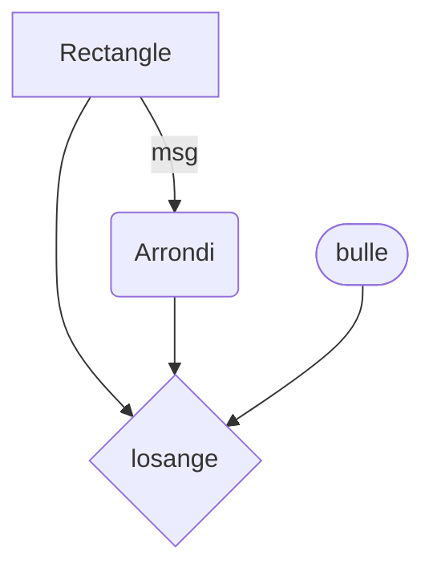

# ES-2 - Scénarisation
# TEMPLATE TEMPORAIRE

Lorem ipsum blabla  
test diagramme

## Idées
### Concept
### Objectifs
### Motivations
 

## Scénario
### Logigramme de l'interactivité

### Narratif (synopsis?)
### Expérience utilisateur
 

## Ambiance
### Moodboard visuel

### Moodboard sonore
### Références artistiques
 

## Technologies
### Support médiatique
### Matériel
- M5Stack :
    - AtomPoE
    - AtomLite
    - PbHub unit
    - PIR unit
    - Light unit
    - RGB LED strip

- Affichage :
    - Télévisions CRT ou LCD

- Éclairage :
    - American DJ 5P HEX

- Autres :
  - Ordinateur
  - Barres d'alimentation
  - Rallonges électriques
  - Câbles USB type C
  - Câbles XLR
  - Adaptateur XLR à USB
  - Câbles HDMI/ RCA/ S-Video/ YPbPr (selon le type de TV) + adaptateurs
  - Meuble DIY pour installer les écrans
  - Structure + accessoires pour installer les lumières
  - Haut-parleurs
  - Trépieds pour haut-parleurs
  
### Logiciels
- TouchDesigner
- Arduino IDE
- Maya/ Blender
- Illustrator
- After Effect
