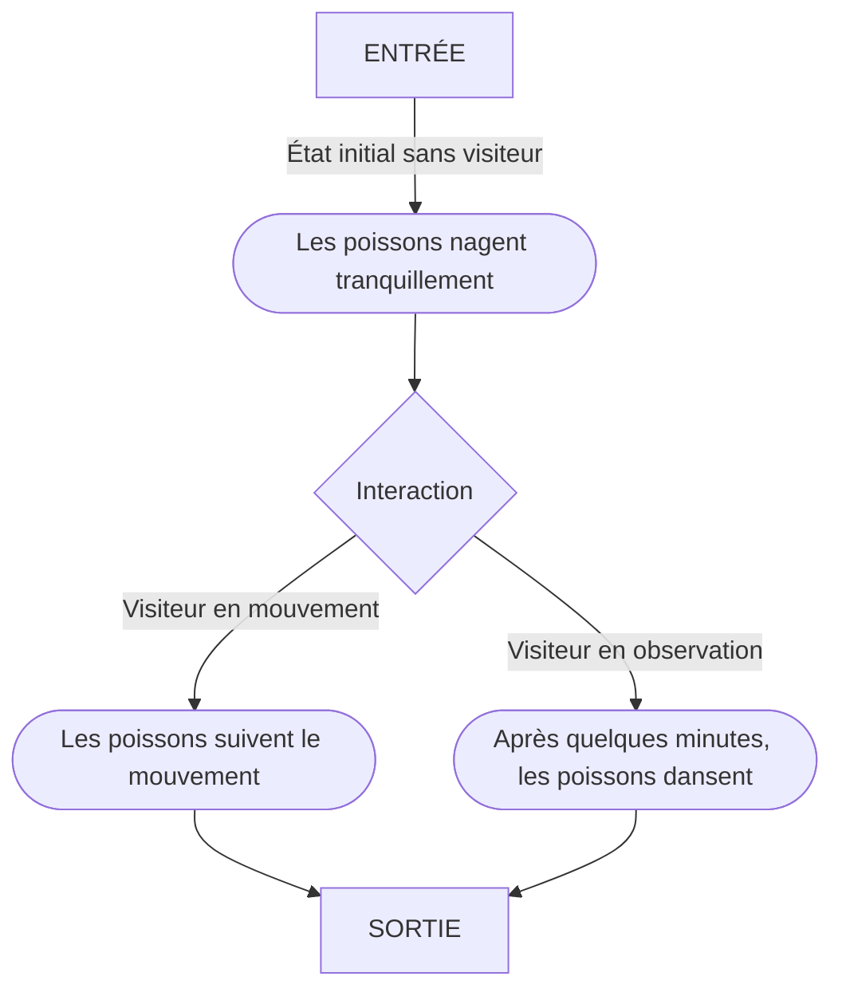

# ES-2 - Scénarisation

## Idées
### Concept :
Le projet utilise des télévisions cathodiques pour afficher des poissons en 3D dans un aquarium virtuel. Quand une personne s'approche de l'écran, des capteurs déclenchent une réaction des poissons, qui viennent à sa rencontre.

### Objectif :
Combiner la modernité et la nostalgie, en plus de la réutilisation de télévisions. Le choix de l'écran cathodique ajoute une texture visuelle unique, comme les couleurs plus saturées et l'effet légèrement flou, renforçant l'expérience sensorielle pour le spectateur.
 

## Scénario
### Logigramme de l'interactivité

### Expérience utilisateur
Les visiteurs circulent dans un corridor composé de télévisions cathodiques superposées qui simulent les installations d'aquarium dans une animalerie. Des bandes de lumières RGB encadrent chacunes des télévisions et diffusent une teinte personnalisée selon l'environnement diffusé.  
 
Des capteurs de mouvements détectent la présences des visiteurs et attirent des poissons 3D vers ceux-ci. Après un certain temps, les poissons s'animent selon l'emplacement du visiteur pour exécuter une danse au rythme d'une musique.
 

## Ambiance
### Moodboard visuel

### Moodboard sonore
[État initial et en mouvement](https://pixabay.com/music/ambient-deep-in-the-ocean-116172/)  
[Danse des poissons](https://pixabay.com/music/ambient-wondrous-waters-119518/)
 

## Technologies
### Support médiatique
### Matériel
- M5Stack :
    - AtomPoE
    - AtomLite
    - PbHub unit
    - PIR unit
    - Light unit
    - RGB LED strip

- Affichage :
    - Télévisions CRT ou LCD

- Éclairage :
    - American DJ 5P HEX

- Autres :
  - Ordinateur
  - Barres d'alimentation
  - Rallonges électriques
  - Câbles USB type C
  - Câbles XLR
  - Adaptateur XLR à USB
  - Câbles HDMI/ RCA/ S-Video/ YPbPr (selon le type de TV) + adaptateurs
  - Meuble DIY pour installer les écrans
  - Structure + accessoires pour installer les lumières
  - Haut-parleurs
  - Trépieds pour haut-parleurs
  
### Logiciels
| TouchDesigner | Arduino IDE | Maya | Illustrator | After Effect |
|----|----|----|----|----|

